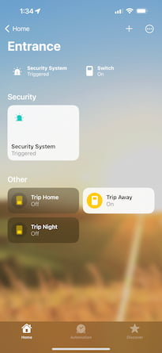

# homebridge-securitysystem

Homebridge plugin that creates a security system accessory that can be triggered by HomeKit sensors.

## Installation

If you already have [Homebridge](https://github.com/homebridge/homebridge) installed, execute the following command:

`npm i -g --unsafe-perm homebridge-securitysystem`

## Demo

  
  
Want to know how it looks like? It's pretty customizable, you can configure it to show as many switches as you like.

  
What you are seeing at your right is <b>the friendliest</b> configuration that you can start with. Each <code>Trip</code> switch that you see can only trip the security system if the mode is currently set. This allows you to create logic-less automations from the very Home app that comes already installed on iOS.

  
There are also <code>Mode</code> switches which let you run automations that interact with your accessories when a mode is changed or set modes bypassing HomeKit confirmation dialogs.

  
A web server, webhooks or even shell commands are available to integrate the security system with other devices or services plus a plenty of more settings to make this plugin your own DIY security system.

  
Homebridge / HOOBS UI is recommended to configure the plugin, for additional help please check the <a href="https://github.com/MiguelRipoll23/homebridge-securitysystem/wiki">Wiki</a> page.

## Automations

Using the `Home` app is recommended for regular users, for more advanced users the `Eve` or a similar app will let you make use of the custom options that the security system itself exposes.

Here are some examples of automations that can be created:

| Trigger                  | Actions                       |
| ------------------------ | ----------------------------- |
| Motion is Detected       | Turn on `Trip Night`          |
| Door is Opened           | Turn on `Trip Away`           |
| NFC Tag is Detected (1)  | Set Security system to `Home` |
| Security System Triggers | Play Audio (2)                |

(1) Shortcuts app is required to create this automation.

(2) AirPlay 2 speaker and Apple Music subscription are required.

## Contributions

Pull requests are welcome.
