# homebridge-securitysystem

[](https://www.npmjs.com/package/homebridge-securitysystem)
[](https://www.npmjs.com/package/homebridge-securitysystem)
[](https://github.com/homebridge/homebridge/wiki/Verified-Plugins)

Homebridge plugin that creates a security system accessory that can be triggered by HomeKit sensors.

[](https://www.buymeacoffee.com/MiguelRipoll23)

## Installation

In the Homebridge UI, go to the plugins section, click the search button, then search for `homebridge-securitysystem`, and click the install button.

## Overview

This plugin implements a fully-featured security system for HomeKit.  Within HomeKit, you can choose one of up to four system modes: <code>Off</code>, <code>Home</code>, <code>Away</code>, or <code>Night</code>.  For example, you may want to trip your system on different inputs or alarm in different ways depending on whether you're away as opposed to asleep at home.  The system can then be in any of five states: <i>Disarmed</i>, <i>Armed Home</i>, <i>Armed Away</i>, <i>Armed Night</i>, or <i>Triggered</i>.  You will need to create your own automations in HomeKit to trip the security system, and you will need to create your own automations to perform any actions (such as sounding/silencing a siren) when the system triggers/resets.

## Available Functionality
The security system is extensively configurable.  There are:
  * Multiple switches available which let you change security modes (bypassing HomeKit confirmations), trip under different configurations, and place safeguards, which are great for use in automations.
  * Sensors asserting for Armed, Tripped/Triggered, and Reset, which are useful for automations and notifications on your phone.
  * Audio options for audible events on connected speakers.
  * Remote access web server options.
  * Webhooks for interacting with other devices and web services during events.
  * Options for executing event-based shell commands.
  * Options for publishing state information to an MQTT broker.

For configuring the plugin, Homebridge / HOOBS UI is recommended, and additional help is available in the <a href="https://github.com/MiguelRipoll23/homebridge-securitysystem/wiki">Wiki</a> page.
Using the `Home` app will suffice for most users, however, third-party apps such as `Eve` will let you make use of more custom options that the security system exposes.

## A Simple Example
### Configuring the plugin in HomeBridge
At its very simplest, you will need to enable at least one arming mode (in this case <code>Away</code>), and at least one trip switch (in this case <code>Trip Away</code>, which we'll name "Trip if Away" for extra clarity).  You may set this up in the plugin config or use the following json config:
```json
{
    "accessory": "security-system",
    "name": "HB Security",
    "serial_number": "S3CUR1TYSYST3M",
    "disabled_modes": [
        "Home",
        "Night"
    ],
    "trip_mode_switches": true,
    "trip_away_switch_name": "Trip if Away"
}
```
### Configuring HomeKit in Apple Home
For this example, you will need to create three automations:
  1. Trip the security system when a sensor detects something
  2. Turn on an alarm device when the sytem is tripped
  3. Turn off the alarm device when the system is reset/disarmed

Automation 1: Create an automation for when a sensor (in this case the back door) detects something.  Choose a sensor to trigger the system, and set it to turn on the <code>Trip Away</code> switch.  In the native Apple Home app you need to create an automation like this for every sensor.  Third-party apps like <code>Eve</code> allow you to select multiple sensor inputs in a single automation.
<p align="center">
    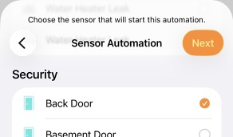
    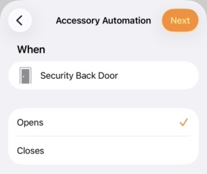
    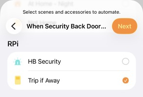
    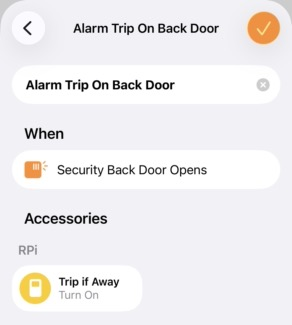
</p>
Automation 2: Create an Automation to turn on an accessory or accessories (e.g. alarm, light, or outlet) when the system has been triggered, initiated by the <code>Trip Away</code> switch.
<p align="center">
    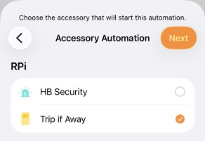
    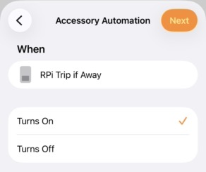
    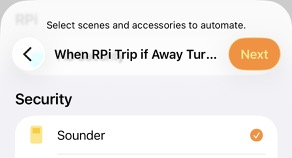
    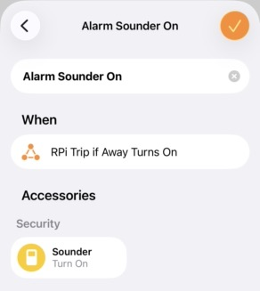
</p>
Automation 3: Create an automation to turn off the above accessory or accessories when the system is reset/disarmed using the <i>disarmed</i> state of the security system.
<p align="center">
    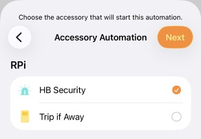
    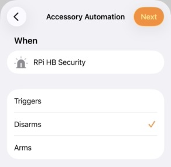
    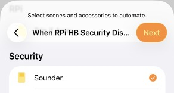
    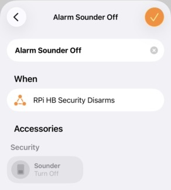
</p>

### Usage
To arm this system, set the active mode to <code>Away</code>.  If the sensor asserts, it will trip the system and activate the alarm device.  To reset/disarm the sytem, set the active mode back to <code>Off</code>.
<p align="center">
    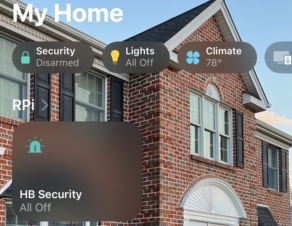
    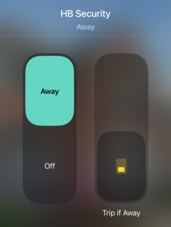
    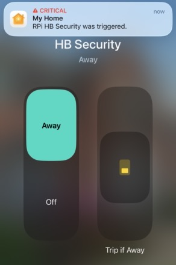
    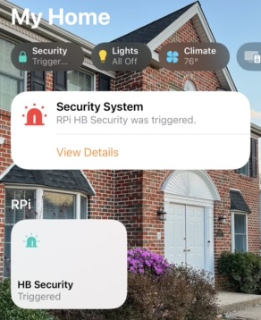
</p>

## Contributions

Pull requests are welcome.
